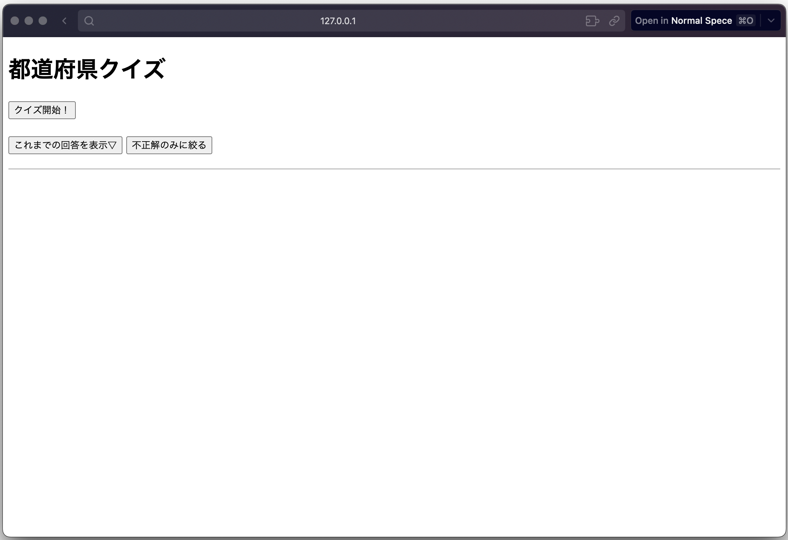
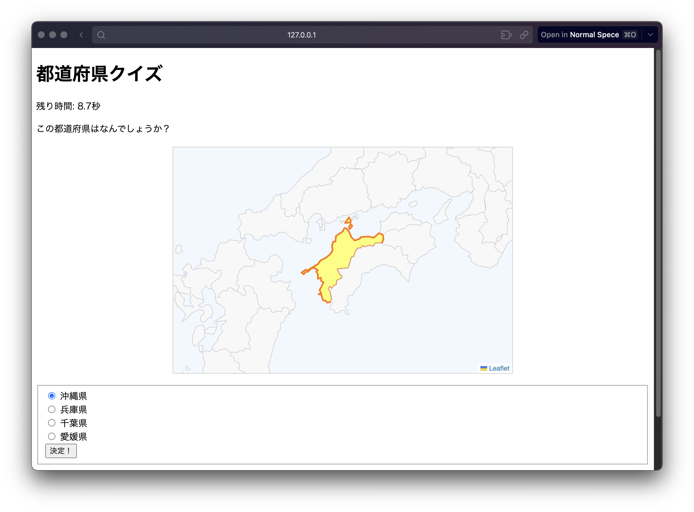
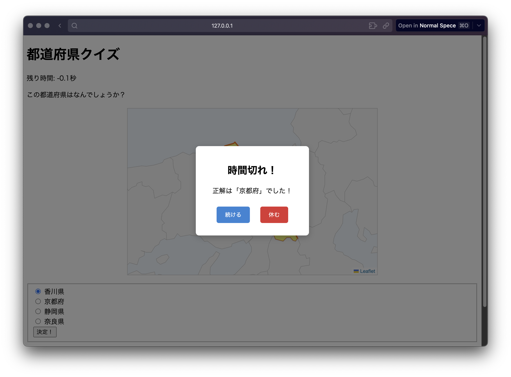
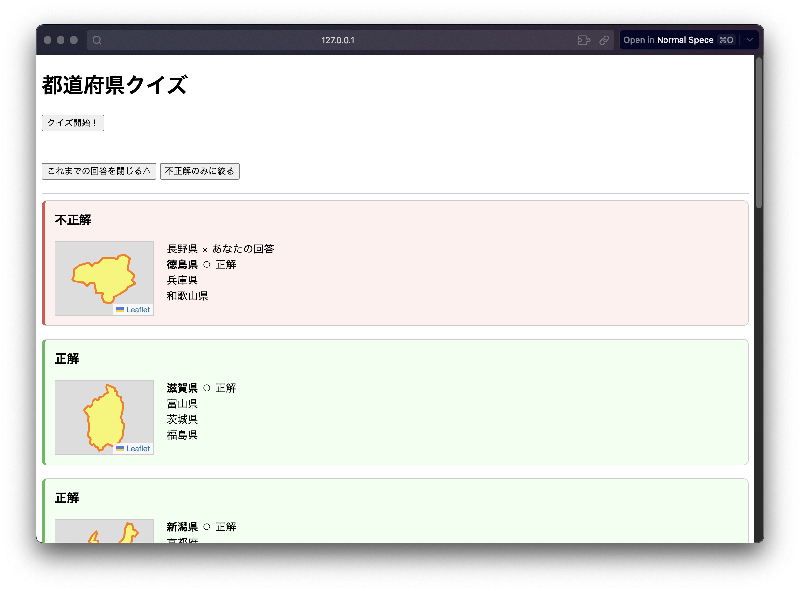
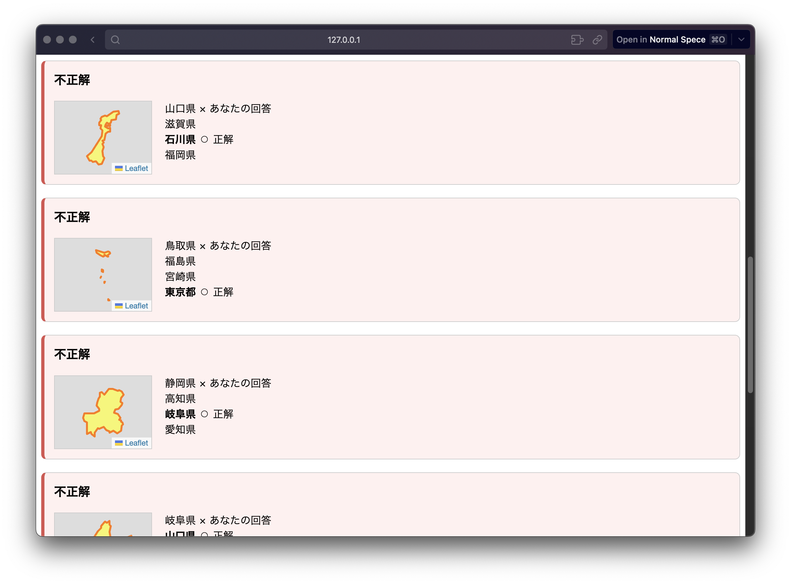

## 都道府県クイズアプリ (Prefectures Quiz App)
Python (Flask) と JavaScript で作成した、4択形式の都道府県当てクイズアプリです。 「直感的な操作感」と「継続したくなるUX」をテーマに開発しました。

## 📸 実行の様子 (Demo)
### 1 スタート画面

シンプルなインターフェースで、ボタンを押すと即座にクイズが始まります。

### 2 クイズプレイ中（キーボード操作対応）

都道府県のシルエット（または地図）が表示され、制限時間内に4つの選択肢から回答します。

工夫点: マウス操作だけでなく、**キーボード**（**矢印キーで選択、Enterで決定**）でも快適に操作できるようイベントハンドリングを実装しています。

### 3 独自のインタラクション（カスタムアラート）

正解・不正解の判定には、ブラウザ標準の alert() ではなく、Promiseを用いた非同期処理による自作モーダルウィンドウを採用しました。これにより、ゲームのテンポを崩さずに結果を表示できます。

### 4 振り返り機能（履歴・フィルタリング）

回答結果はリアルタイムでリスト化されます。

「不正解のみ」に絞り込むフィルタリング機能を搭載しており、苦手な都道府県を重点的に復習できます。

## 🛠 使用技術
Frontend: HTML5, CSS3, JavaScript (Vanilla JS)

Fetch APIによる非同期通信 (SPA風の挙動)

DOM操作による動的な画面描画

Backend: Python 3.x, Flask

RESTfulなAPI設計 (/api/quiz)

Data: JSON (quizzes.json)

## 💡 技術的なこだわりと課題解決
### 1 著作権課題へのアプローチ (GeoJSONの活用検討)
開発当初、シルエット画像の著作権（再配布可否）が課題となりました。 これに対し、静止画に依存しない解決策として Leaflet.js や GeoJSON（地理空間データ）を用いて、ベクターデータから動的に地図を描画する手法を検討・検証しました。

これにより、著作権フリーかつ軽量なアプリケーション構築の知見を得ることができました。

(※現在はデモ用として軽量な画像データ版で動作させています)

### 2 状態管理とアーキテクチャ
script.js 内では gameState 変数を用いてアプリの状態（スタート待機、クイズ中、ダイアログ表示中）を管理し、キーボード入力のイベント処理を適切に振り分ける設計にしています。

### 🧑‍💻 開発の振り返りと今後の展望
「使っていて心地よい」操作感を最優先に設計しました。マウス不要のキーボード操作対応や、ゲームのテンポを崩さない非同期処理による自作モーダルなど、ユーザー体験（UX）の向上に注力しました。また、学習ツールとしての実用性を高めるため、履歴フィルタリング機能も実装しています。

現在はAIのサポートを受けた部分もありますが、今後は「自力でのフルスクラッチ開発」ができる技術力を身につけることが目標です。同様のアプリケーションを繰り返し実装し、身につけていく予定です。

## 🚀 実行方法 (How to run)

###  リポジトリのクローン
git clone https://github.com/Ume-Chika/pref_quiz.git

### ディレクトリへの移動
cd pref_quiz

### 依存ライブラリのインストール
pip install flask

### アプリケーションの実行
python app.py
ブラウザで http://127.0.0.1:5001 にアクセスしてください。